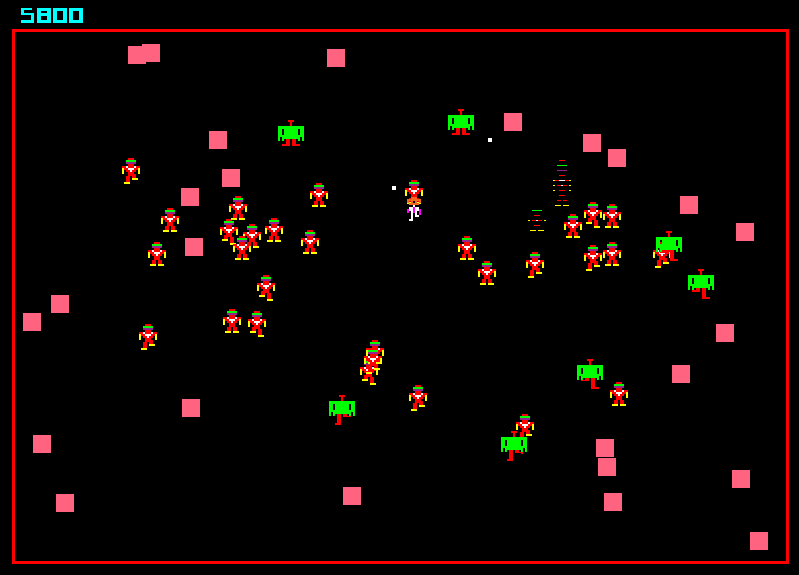

# Robotron: 2084

Clone of one of my favorite games.

To run it, type

    $ ./gradlew run

Move using TFGH, and fire using the arrow keys.

I know that it would be better to use WASD, but [there's currently a Java bug that prevents this on MacOS](http://stackoverflow.com/questions/43192166/on-mac-in-java-keypressed-event-doesnt-fire-for-certain-keys/43960171#43960171).
Once Oracle fixes that bug, I'll switch to WASD.

Pull requests welcome. Appreciate attempts to be reasonably faithful to the original.
